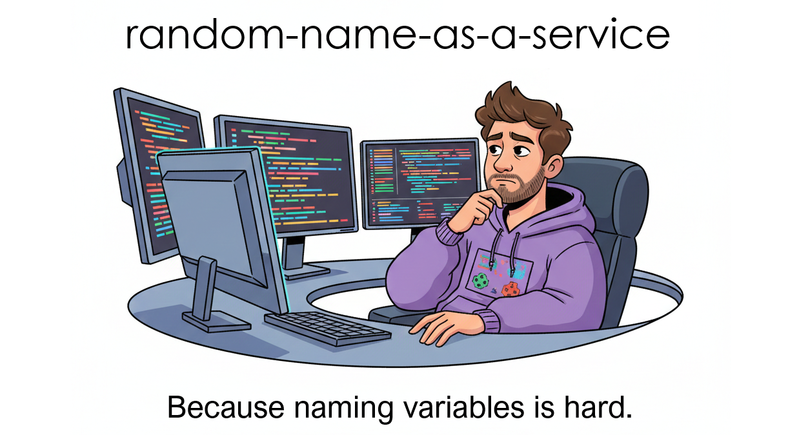

# 🎲 Random Name as a Service (RNaaS)

> This project exists to answer a simple question well:
>
> “Can we provide useful randomness without unnecessary complexity?”
>
> The answer is yes—by keeping the surface area small and the expectations clear.



A lightweight HTTP-accessible service (and an self-hosted API) that returns a random, human-readable name
composed of a characteristic and an animal. Perfect for naming variables, resources, and temporary entities or in identifiers, demos, placeholders, and testing.

## ⚙️ What It Does

Each request returns a randomly generated name in the form:

`<characteristic>-<animal>`

The vocabulary is sourced from curated datasets of real English characteristics and real animal names.

## 📜 API Contract

###
Base URL
```text
https://rn.kerneltalks.com/
```
### Endpoint
```sql
GET /
```
### Response
```json
{
  "name": "<string>"
}
```
- Always returns JSON
- Stateless
- No parameters required
- No authentication

## 🗄️ Data Sources

The service uses two vocabularies:

- `data/animals.json`
- `data/characteristics.json`

Each file contains a fixed set of real words. They can be extended or replaced without changing the API contract.

## ▶️ Usage

### Browser
```text
https://rn.kerneltalks.com/
```
curl
```sh
curl https://rn.kerneltalks.com/
```
Example output:
```json
{"name":"resilient-wolf"}
```
Each request is independent.

## 🗂️ Repository Structure
```pgsql
random-names-as-a-service/
├── .dockerignore
├── .gitignore
├── assets/
│   ├── rnaas.png
├── Dockerfile
├── LICENSE
├── README.md
├── data/
│   ├── animals.json
│   └── characteristics.json
├── index.html
├── package.json
└── src/
    └── index.js

```
## 🐳 Self Hosting on Docker

1. Clone the Repository
```bash
git clone https://github.com/slavhate/random-name-as-a-service
cd random-name-as-a-service
```

2. Build it
```bash
docker build -t rnaas .
```

3. Run it
```bash
docker run -p 3000:3000 rnaas
```
 
4. Use it

```bash
curl http://localhost:3000
```

Response
```bash
{"name":"softspoken-hippopotamus"}
```

## 📐 Guarantees and Non-Guarantees
### Guaranteed

- Valid JSON response

- Human-readable output

- No state retained between requests

- No rate limits for typical usage

### Not Guaranteed

- Deterministic output

- Uniqueness across requests

- Stability across time or clients

This service favors simplicity over strict guarantees.

## 🧩 Extensibility

Common extensions include:

- adding more vocabularies

- introducing optional prefixes or suffixes

- filtering by category

- client-side seeding for repeatability

The core contract remains unchanged.

## 📄 License

MIT License.
